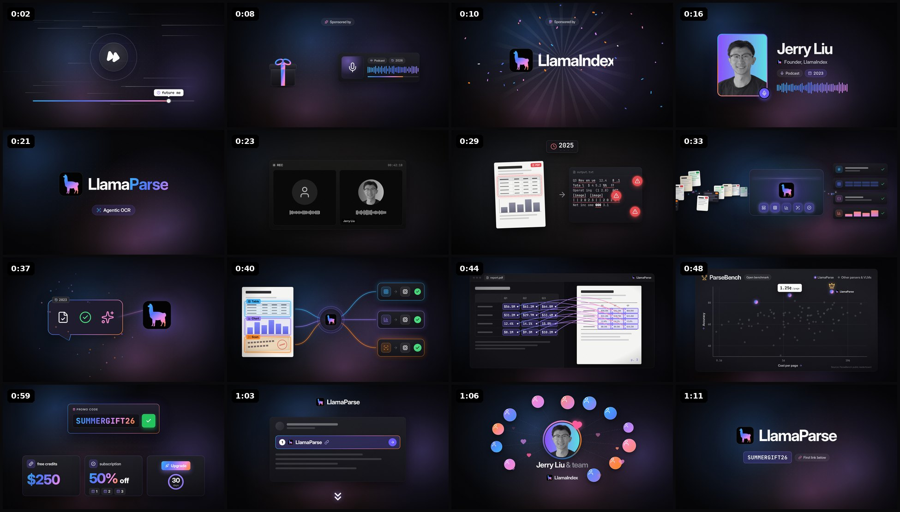

# LlamaParse sponsor segment

A 73-second motion-graphics sponsor read for **LlamaParse** (by LlamaIndex), styled like a SaaS product video: dark UI, LlamaIndex's brand gradient, product-style mockups, little on-screen text, and synced sound design. Every beat is timed to the script.

- **Video:** [`renders/llamaparse-sponsor-1080p60.mp4`](renders/llamaparse-sponsor-1080p60.mp4). 1920×1080, 60 fps, H.264, with the sound design mixed in (AAC 320 kbps). Drop your voiceover on top.
- **Sound stems:** [`renders/audio/sfx.wav`](renders/audio/sfx.wav) and [`renders/audio/ambience.wav`](renders/audio/ambience.wav) (48 kHz, 24-bit). Together they add up to the video's soundtrack, so you can rebalance them in your editor.
- **Source:** HTML + [GSAP](https://gsap.com). Every frame is a pure function of time, and frames are rendered in headless Chromium and encoded with ffmpeg. The sound is synthesized with the Web Audio API from the same timeline.



## Storyboard

Times are the defaults in `src/cues.js`. They are estimated for a read at about 174 wpm (see [Retiming](#retiming-to-your-voiceover)).

| # | Time | Script | On screen |
|---|------|--------|-----------|
| 1 | 0:00 | *Quick interruption from my future self* | A pause button slams in and flips to fast-forward. The progress bar zips ahead with a "future me" tag. |
| 2 | 0:03 | *…present you a very nice sponsor… on the podcast a few years ago,* | A gift box drops in and its lid rattles on "sponsor". A podcast episode card slides in and its year rolls back from 2026 to 2023. |
| | 0:10 | *LlamaIndex.* | The gift bursts open into the **LlamaIndex logo**, with confetti and light rays. |
| | 0:11 | *Yes, the very same RAG framework* | The LlamaIndex logo holds center stage on its own. |
| 3 | 0:13 | *where I had Jerry Liu, the founder, on my podcast in 2023.* | Jerry Liu's portrait, name, "Founder, LlamaIndex", Podcast and 2023 chips, and a live waveform. |
| 4 | 0:18 | *Except now it's all about LlamaParse, their agentic OCR.* | "Index" rolls out, "Parse" rolls in (**LlamaIndex → LlamaParse**), and the logo spins. An *Agentic OCR* chip appears as a scan beam passes. |
| 5 | 0:22 | *In the episode I recorded with Jerry, I told him that PDFs would remain a problem for a very long time,* | Grayscale 2023 flashback of the podcast recording. A PDF then becomes a garbled `output.txt` with red warnings, and a year ticker counts 2023 → 2026. |
| 6 | 0:30 | *and now they built the most powerful OCR pipeline I've ever seen.* | A flash back into color. PDFs, scans, sheets and slides stream into the LlamaParse engine, and clean text, table, JSON and chart outputs check off. |
| 7 | 0:34 | *I guess they might have took that a bit personally.* | The 2023 complaint bubble appears. The llama fumes (💢), charges, and zaps it, and every ✗ turns into a ✓. |
| 8 | 0:38 | *LlamaParse sends tables, charts, and scans to the right model* | Table, Chart and Scan regions light up on each word and route through the llama router to their own models, which check off on "right model". |
| 9 | 0:41 | *and then traces every value back to its source.* | A LlamaParse app window: each parsed value links to its bounding box on the source PDF page. |
| 10 | 0:45 | *On their open benchmark, it comes out on top for a fraction of the cost.* | A **ParseBench** scatter of accuracy vs. cost per page, using real leaderboard data. The LlamaParse dots rise to the top, a crown lands, and a 1.25¢/page tag appears. |
| 11 | 0:50 | *Use the code SUMMERGIFT26 for $250 in free credits and half off your first three months… within 30 days.* | The promo code types out and gets copied. Tiles follow: $250 free credits (counting up), 50% off with months 1·2·3, and an Upgrade click with a 30-day ring. |
| 12 | 1:00 | *Check out LlamaParse with the first link in the description below,* | A video description box: link **1 · LlamaParse** highlights and gets clicked, and arrows point down. |
| 13 | 1:04 | *and go support my friend Jerry Liu and his amazing team.* | Jerry with a heart, team avatars orbiting in, and the LlamaIndex logo. |
| 14 | 1:08 | *The offer stands for the whole October month.* | An October 2026 calendar fills day by day with the brand gradient, next to the code chip. |
| 15 | 1:11 | *Now, let's get back to the video.* | An end card (LlamaParse, code, first link), then a play button. The progress bar rewinds and an iris closes to black. |

## Preview

```bash
npm install
npm run preview        # open http://localhost:5173
```

- **Space** plays and pauses. **←/→** step one frame (hold **Shift** for 1 s). The scrubber seeks.
- **Captions** shows the script line for the current moment, so you can judge pacing.
- **Sound** plays the sound design. It renders in the browser a few seconds after the page loads.
- **Load VO** plays your recorded voiceover in sync with the animation.
- `?t=41.5` in the URL opens the preview at a given time.

## Render

Rendering needs [ffmpeg](https://ffmpeg.org) on `PATH` (or set `FFMPEG=/path/to/ffmpeg`).

```bash
npm run render                                    # 1080p60 with sound -> out/llamaparse-sponsor-1080p60.mp4
node tools/render.mjs --fps 30                    # other frame rates: 24, 25, 30...
node tools/render.mjs --fps 30 --scale 0.5 --out out/draft.mp4   # fast 540p draft
node tools/render.mjs --vo vo.wav                 # add your voiceover; the sound design ducks under it
node tools/render.mjs --no-sound                  # picture only
node tools/render.mjs --from 37 --to 45           # render only a section
npm run sound                                     # sound only -> out/audio/{sound-design,sfx,ambience}.wav
node tools/stills.mjs 12.5 41                     # PNG stills to out/stills/ (or --cues, --every 2)
```

Other options: `--crf` (quality, default 16; the committed file uses 18), `--workers` (parallel browser pages), and `--preset` (x264 preset).

## Sound design

All of the sound is synthesized: oscillators, seeded noise, filters and a generated reverb (`src/sound.js`). There are no samples, so there is nothing to license. Each sound is scheduled in `src/scenes.js` next to the animation beat it belongs to, panned to where the action is on screen, so retiming the cues moves the sound with the picture. Tonal sounds use D major pentatonic, so overlapping chimes never clash.

| Shot | Sounds |
|------|--------|
| Interruption | Record scratch and a thud as the pause button slams in, then a tape fast-forward whoosh to "future me" |
| Sponsor → LlamaIndex | The gift drops with a thud and its lid rattles. The podcast card swipes in, and the year rewinds with clock ticks. The gift bursts into a logo sting (reverse swell, hit, bell chord, sparkles) with confetti |
| Jerry | Pops for the photo and chips, and a card flip for "2023" |
| LlamaParse | Letter ticks as "Index" rolls out and "Parse" rolls in, a brighter logo sting, and a scanner sweep for "agentic OCR" |
| 2023 flashback | Everything goes lo-fi, with vinyl crackle and muffled ambience: a record beep, a paper slide, garbled teletype chatter, three error bonks with a glitch, then clock ticks speeding up into a riser |
| Pipeline | A cinematic hit and power-up with a machine hum. Documents whoosh in, the outputs check off on a rising marimba, and there's a surge on "powerful" |
| "Personally" | The llama growls and steams, charges up, and fires a laser zap at the bubble. Impact, sparkles, and a success chime |
| Routing | Each region blips as it's detected, data zips across to its model and locks in, and three checks chime |
| Source tracing | A click, then a cascade of pings as each value links to the page |
| Benchmark | A soft rain of plinks for the grey dots, rising chimes for LlamaParse, a crown ding with bounces, and a coin for "1.25¢" |
| Offer | Keyboard typing for the code, a click and "copied" chime, a counter ticking to $250 with a coin, pops for months 1-2-3, and an Upgrade level-up with the 30-day ring ticking round |
| Link / team / October | A link click, bouncing boops, heartbeats, the team popping in on a scale, and a marimba run as October fills |
| Outro | End-card sting, play click, a tape rewind, and an iris whoosh to black |

**Levels.** The mix sits around −24 LUFS integrated, with peaks near −4 dBFS, so it sits under a voiceover at −14 to −16 LUFS without a fight. The ambience bed (an airy Dmaj9 pad, high-passed at 120 Hz to stay out of the voice's range) is about 11 dB under the effects. Adjust one sound with its `gain` in `src/scenes.js` (peak dBFS), or the whole mix with `MASTER_DB` in `src/sound.js`, then run `npm run sound`.

**With your voiceover.** Either put the video or stems under your VO in your editor, or run `node tools/render.mjs --vo vo.wav`. That sidechain-ducks the sound design under your voice and mixes both into the MP4.

## Retiming to your voiceover

All motion is keyed to the voiceover lines in **`src/cues.js`**:

```js
{ id: 'route', start: 37.97, end: 41.23, marks: { tables: 0.29, charts: 0.43, scans: 0.57, right: 0.79 }, ... }
```

- `start` and `end` are when the line is spoken, in seconds from the start of the segment.
- `marks` are where key words fall inside the line, as fractions of its length. For example, the Table, Chart and Scan boxes pop on those exact words. Marks stretch automatically when you change `start` and `end`, so usually you only edit those two numbers.

To sync to a real read, load the VO in the preview (or any audio editor), note where each line starts and ends, update `src/cues.js`, and re-render. If your read is just faster or slower overall, regenerate every cue at a different speaking rate:

```bash
python3 tools/estimate_cues.py 4.6   # syllables per second; the default 4.3 is about 174 wpm
```

## What's in here

```
index.html            all 15 shots (markup)
src/cues.js           voiceover timing (edit this to retime)
src/scenes.js         the GSAP timeline: every animation beat
src/styles.css        brand tokens + layout
src/sound.js          sound design: synth patches, reverb, ambience, offline render
src/player.js         preview controls + render hooks
src/parsebench.js     ParseBench leaderboard data used in the chart
tools/render.mjs      Playwright -> ffmpeg renderer (parallel), muxes the sound
tools/sound.mjs       sound design -> WAV stems (and --mux into an existing video)
tools/stills.mjs      still-frame export
tools/estimate_cues.py
assets/               logo mark, fonts, Jerry Liu photos, dither texture
renders/              the rendered video + audio stems
```

## Brand and data sources

- **Logo:** the llama silhouette from LlamaIndex's official logo (`LlamaSquareBlack.svg` in [run-llama/llama_index](https://github.com/run-llama/llama_index) docs assets). It is recolored with the gradient sampled from the current LlamaIndex favicon: cyan `#3eb4fb` → indigo `#5475fd` → violet `#987df8` → pink `#fe8cd2` → orange `#ff8722`.
- **UI colors:** the dark theme of LlamaIndex's own component library, [`@llamaindex/ui`](https://www.npmjs.com/package/@llamaindex/ui): primary `#6b5bff`, background `#101013`, card `#17171b`, accent `#c5bdff`. Its font, **Inter**, is paired with **JetBrains Mono** for code.
- **Benchmark:** [ParseBench](https://github.com/run-llama/ParseBench) public `leaderboard.csv`, fetched 27 Sep 2026. Every provider with a published cost is plotted as overall score vs. cost per page on a log scale. Other providers are deliberately unlabeled grey dots. The crown marks LlamaParse Agentic Plus (90.2, the #1 overall). The 1.25¢/page tag marks LlamaParse Agentic (87.0), which outscores every non-LlamaParse entry.
- **Jerry Liu photo:** the portrait you provided. `assets/img/jerry-portrait.jpg` (4:5) is used for the intro card, and `assets/img/jerry-liu.jpg` (a square crop) for the round avatars.
- **Podcast visuals** are generic (mic icon plus waveform). To use your show's cover art, put an `` inside `.pc-cover` in `index.html`.

## Licenses

GSAP is covered by its free [standard license](https://gsap.com/standard-license). The sound design is original and synthesized in code, with no third-party samples. Inter and JetBrains Mono use the SIL Open Font License. The icons are [Lucide](https://lucide.dev) (ISC). The LlamaIndex and LlamaParse names and logo are trademarks of LlamaIndex and are used here for their own sponsored segment.
